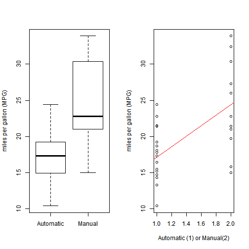

An analysis of Automatic or Manual transmission in respect to mpg
==================================================================

# Executive Summary

There is a set of variables related to miles per gallon (MPG) (outcome).

Here the difference of the MPG between automatic and manual transmissions is focused, 
the `mtcars` dataset in car package is taken as the data source, 
and techniques about regression models is used to solve the following two questions:

* "Is an automatic or manual transmission better for MPG"
*  "Quantifying how different is the MPG between automatic and manual transmissions?"


# Data Processing

## Load and Test Data

The data was extracted from the 1974 Motor Trend US magazine, and comprises fuel consumption and 10 aspects of automobile design and performance for 32 automobiles (1973-74 models).


```r
library(datasets)
mpgData <- with(mtcars, data.frame(mpg, am))
mpgData$am <- factor(mpgData$am, labels = c("Automatic", "Manual"))
#summary(mpgData)
```

## Process Data

### Q1: Is an automatic or manual transmission better for MPG?  


```r
summary(mpgData[mpgData$am == "Automatic",])
```

```
##       mpg               am    
##  Min.   :10.4   Automatic:19  
##  1st Qu.:14.9   Manual   : 0  
##  Median :17.3                 
##  Mean   :17.1                 
##  3rd Qu.:19.2                 
##  Max.   :24.4
```

```r
summary(mpgData[mpgData$am == "Manual",])
```

```
##       mpg               am    
##  Min.   :15.0   Automatic: 0  
##  1st Qu.:21.0   Manual   :13  
##  Median :22.8                 
##  Mean   :24.4                 
##  3rd Qu.:30.4                 
##  Max.   :33.9
```

### Q2: Quantifying how different is the MPG between automatic and manual transmissions?  


```r
fit <- lm(mpg ~ as.integer(am), data=mpgData)
summary(fit)
```

```
## 
## Call:
## lm(formula = mpg ~ as.integer(am), data = mpgData)
## 
## Residuals:
##    Min     1Q Median     3Q    Max 
## -9.392 -3.092 -0.297  3.244  9.508 
## 
## Coefficients:
##                Estimate Std. Error t value Pr(>|t|)    
## (Intercept)        9.90       2.63    3.77  0.00072 ***
## as.integer(am)     7.24       1.76    4.11  0.00029 ***
## ---
## Signif. codes:  0 '***' 0.001 '**' 0.01 '*' 0.05 '.' 0.1 ' ' 1
## 
## Residual standard error: 4.9 on 30 degrees of freedom
## Multiple R-squared:  0.36,	Adjusted R-squared:  0.338 
## F-statistic: 16.9 on 1 and 30 DF,  p-value: 0.000285
```

# Results
So, manual transmission is better than automatic for MPG, which increased by 7.2449.

# Appendix

## Fig 1. MPG between automatic and manual transmissions

```r
par(mfrow=c(1,2))
with(mpgData,{
     boxplot(mpg ~ am, 
             ylab = "miles per gallon (MPG)")
     plot(mpg ~ as.integer(am),
             xlab = "Automatic (1) or Manual(2)",
             ylab = "miles per gallon (MPG)")
     abline(fit, col=2)
     })
```

 


```r
# To make HTML and markdown file from the Rmarkdown file
#library(knitr)
#knit("mpg.Rmd")
#knit2html("mpg.Rmd")
```
## SourceCode
https://github.com/vksbhagat/RegMod_PeerAssesment1
